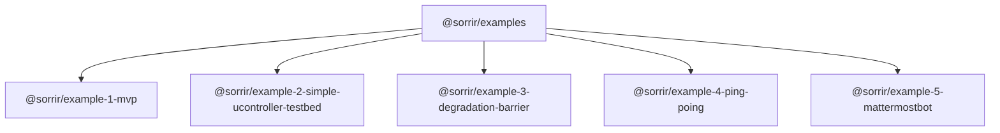

# SORRIR Examples

This repository holds different examples illustrating the features of the SORRIR framework.



* Example-1-MVP is a software only example. It offers you a first introduction on how to build applications with the
  SORRIR framework.
* Example-2-Simple-uController-Testbed is a hardware and software example. Using the SORRIR framework, you control
  the behavior of a Arduino-based barrier of a parking garage. This example also includes communication to external
  components via MQTT.
* Example-3-Degradation-Barrier is a more advanced hardware and software example. This example introduces the
  degradation functionality of the SORRIR framework (not yet, but soon™). It also covers the integration of external
  components through REST.
* Example-4-Ping-Pong: A simple example with a small number of components to evaluate communication technologies.
* Example-5-Mattermostbot: A simple mattermost bot which just uses the state machine framework. The mattermost bot 
  is used to store information who enters and leaves a lab and notifies a mattermost channel if someone does not leave the lab on time. The example, particularly, shows (1) how to integrate with external systems and (2) how to programmatically and efficiently create state machines transitions avoiding copy&paste-programming.

[[_TOC_]]

## Setup

The repository consists of a root module and several child modules containing an example each. The project can be set up either with `npm` or `pnpm`. If you have decided for a package manager, it is advised to not mix them up.

### With NPM

In the root folder, run `npm install` to setup the sorrir-examples root module. Afterwards, to install dependencies of the examples themselves, run `npm run npm-install-all`.

### With PNPM

In the root folder, run `pnpm install` to setup the sorrir-examples root module. Afterwards, to install dependencies of the examples themselves, run `pnpm run pnpm-install-all`.

### Troubleshooting

Because SORRIR is still under heavy development, its API might change from time to time. In consequence, due to 
caching of already built artifacts, this might lead to unexpected crashes of an example. To fix this, you can run `npm 
run 
clean-up` from the root directory to update all dependencies and rebuild all projects.

### Hardware

Some examples make use of simple mikrocontroller and microelectronic hardware. In the course of our hardware 
examples, we use aa NodeMCU ESP8266 development board. The ESP8266 is microcontroller which is also popular in the 
Arduino 
world.  But don't worry, you do not need to program C code, instead, we make use of a small tool named [ESPhome](https://esphome.io/). ESPHome lets you describe the behavior and connected sensors of a uC in a YAML file. ESPHome 
compiles and deploys the generated C code from your YAML file to your uC. You can find a [getting started 
instruction](https://esphome.io/guides/getting_started_command_line.html) online. Every hardware example contains an 
already prepared YAML file. You just need to install ESPHome and flash your uC.

## For Developers

### Linking SORRIR framework locally

If you want to link your local version of the SORRIR framework containing new fancy features, you can create a 
[symlink](https://docs.npmjs.com/cli/link) (see last line). Therefore, open `package.json` and change the dependency 
of the SORRIR framework as it can bee seen below. Because of the local import, it is 
necessary to build the SORRIR framework first. Therefore, open your framework workspace and run from your command 
line `npm run build`. You have to do this after you made changes to the framework project, again.

```json
{
  "name": "your-project",
  ...
  "dependencies": {
    "sorrir-framework": "file:../your/local/path"
  }
}
```
*Content of package.json*

### Integration of a new example

If a new example should be added to the repository, a structure like in the already existing examples should be used.

For integration into the `ci-workflow`, following procedure must be used. In [.gitlab-ci.yml](https://gitlab-vs.informatik.uni-ulm.de/sorrir/examples/-/blob/master/.gitlab-ci.yml):

1. Add your example to the variables section
```
variables:
  EXAMPLE_1_MVP_PATH: "example-1-mvp"
  EXAMPLE_2_SIMPLE_UCONTROLLER_TESTBED_PATH: "example-2-simple-ucontroller-testbed"
  NEW_EXAMPLE_PATH: "new-example"
```
2. In the `npm` stage, create a job for your example:
```
npm_example1:
  only:
    changes:
      - "$EXAMPLE_1_MVP_PATH/**"
  <<: *npm
  variables:
    EXAMPLE_PATH: "$EXAMPLE_1_MVP_PATH"

npm_your-example:
  only:
    changes:
      - "$NEW_EXAMPLE_PATH/**"
  <<: *npm
  variables:
    EXAMPLE_PATH: "$NEW_EXAMPLE_PATH"
```
3. In the `test` stage, create a job for your example:
```
test_example1:
  only:
    changes:
      - "$EXAMPLE_1_MVP_PATH/**"
  <<: *test
  variables:
    EXAMPLE_PATH: "$EXAMPLE_1_MVP_PATH"
  dependencies:
    - npm_example1

test_your-example:
  only:
    changes:
      - "$NEW_EXAMPLE_PATH/**"
  <<: *test
  variables:
    EXAMPLE_PATH: "$NEW_EXAMPLE_PATH"
  dependencies:
    - npm_your-example
```
4. In the `containerize` stage, create a job for your example:
```
containerize_example1:
  only:
    changes:
      - "$EXAMPLE_1_MVP_PATH/**"
  <<: *containerize
  variables:
    EXAMPLE_PATH: "$EXAMPLE_1_MVP_PATH"
    CUSTOM_REG_IMAGE: "$CI_REGISTRY_IMAGE/$EXAMPLE_1_MVP_PATH"
  dependencies:
    - npm_example1

containerize_your-example:
  only:
    changes:
      - "$NEW_EXAMPLE_PATH/**"
  <<: *containerize
  variables:
    EXAMPLE_PATH: "$NEW_EXAMPLE_PATH"
    CUSTOM_REG_IMAGE: "$CI_REGISTRY_IMAGE/$NEW_EXAMPLE_PATH"
```
